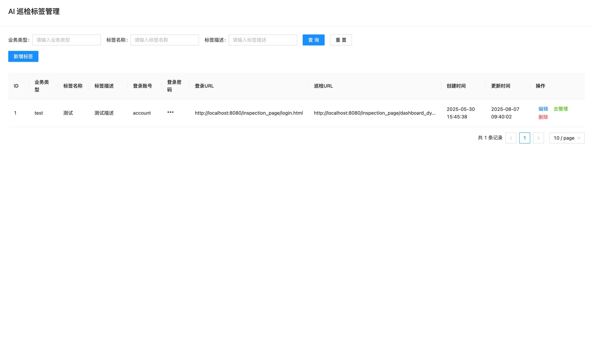
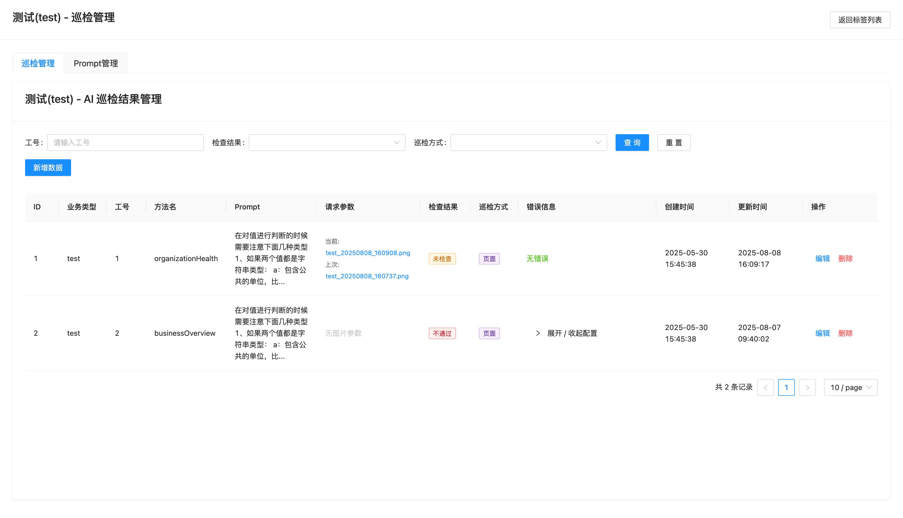
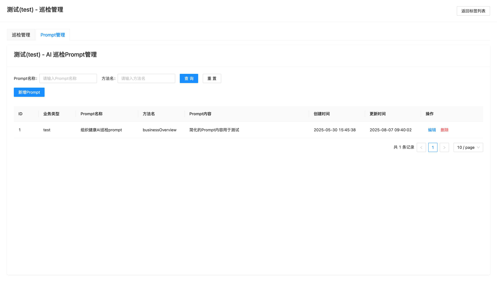

# AI智能巡检系统

<div align="center">


**基于人工智能的自动化质量保障平台**

[](https://spring.io/projects/spring-boot)
[](https://reactjs.org/)
[](https://dashscope.aliyun.com/)
[](https://playwright.dev/)

[功能特性](#功能特性) • [快速开始](#快速开始) • [系统架构](#系统架构) • [功能截图](#功能截图) • [文档导航](#文档导航)

</div>

## 📖 产品简介

AI智能巡检系统是一款基于人工智能技术的自动化质量保障平台，通过集成**阿里云通义千问多模态大模型**，实现对业务系统的智能化监控与异常检测。系统采用定时任务机制，自动执行页面截图对比、数据指标分析、多维度阈值判断等功能，为企业提供**7x24小时无人值守**的数字化巡检解决方案。

### 🎯 核心价值

- **🚀 效率提升90%+**：从人工巡检到AI自动巡检，监控效率大幅提升
- **💰 降低运维成本**：无需人工值守，显著降低运维人力投入
- **🎯 精准识别异常**：AI智能分析，准确识别真正的异常，减少误报率
- **📈 数据驱动决策**：提供详细的巡检数据和趋势分析，支持运维决策优化

## ✨ 功能特性

### 🔬 智能化检测引擎
- **多模态AI分析**：集成阿里云通义千问，支持图像和文本的联合智能分析
- **智能差异识别**：自动识别页面中的数据变化、布局调整、元素异常
- **上下文理解**：结合业务场景和历史数据进行智能判断
- **误报优化**：通过机器学习持续优化检测准确性

### 🤖 自动化巡检流程
- **定时任务调度**：支持cron表达式和固定间隔的灵活调度
- **浏览器自动化**：基于Playwright的多浏览器页面操作和截图
- **登录态管理**：自动模拟登录流程并维持会话状态
- **异常处理**：完善的重试机制和异常恢复策略

### 🛠️ 智能比较工具链
- **阈值比较工具**：支持百分比和绝对值的动态阈值判断
- **波动分析工具**：识别数据的时序变化趋势和异常波动
- **字符串比较工具**：精确匹配和模糊匹配的字符串分析
- **JSON比较工具**：结构化数据的深度比较分析

### 📊 可视化管理界面
- **标签管理**：业务场景分类、登录凭证、巡检目标统一配置
- **Prompt管理**：AI提示词模板的可视化编辑和版本管理
- **结果分析**：巡检结果的多维度查询、差异详情展示
- **集成化操作**：Tab页面设计，实现配置到执行的一体化管理

## 🚀 快速开始

### 📋 环境要求

- **Java**: 11+
- **Maven**: 3.6+
- **浏览器**: Chrome/Chromium (Playwright自动安装)
- **网络**: 需要访问阿里云DashScope API

### ⚡ 快速启动

1. **克隆项目**
   ```bash
   git clone <repository-url>
   cd ai_inspection
   ```

2. **配置AI服务**
   ```yaml
   # src/main/resources/application.yml
   dashscope:
     api:
       key: your-dashscope-api-key  # 替换为你的API密钥
   ```

3. **启动应用**
   ```bash
   mvn spring-boot:run
   ```

4. **访问系统**
   ```
   http://localhost:8080
   ```

### 🔧 配置说明

系统启动后会自动：
- 初始化H2内存数据库
- 创建示例数据
- 启动定时巡检任务
- 提供Web管理界面

详细配置请参考：[📋 配置开关文档](./docs/技术文档/配置开关.md)

## 🏗️ 系统架构

### 📐 技术架构

```
┌─────────────────┐    ┌─────────────────┐
│   React前端应用   │    │   Ant Design UI │
└─────────────────┘    └─────────────────┘
                                │
                                ▼
┌─────────────────────────────────────────────────────────────────┐
│                    Web表示层                                     │
│  ┌─────────────┐  ┌─────────────┐  ┌─────────────┐            │
│  │ 标签管理     │  │ Prompt管理   │  │ 巡检结果     │            │
│  │ Controller  │  │ Controller  │  │ Controller  │            │
│  └─────────────┘  └─────────────┘  └─────────────┘            │
└─────────────────────────────────────────────────────────────────┘
                                │
                                ▼
┌─────────────────────────────────────────────────────────────────┐
│                    业务逻辑层                                    │
│  ┌─────────────┐  ┌─────────────┐  ┌─────────────┐            │
│  │ AI图像分析   │  │ 定时任务     │  │ 智能工具链   │            │
│  │ Service     │  │ Processor   │  │ Tools       │            │
│  └─────────────┘  └─────────────┘  └─────────────┘            │
└─────────────────────────────────────────────────────────────────┘
                                │
                                ▼
┌─────────────────────────────────────────────────────────────────┐
│                    基础设施层                                    │
│  ┌─────────────┐  ┌─────────────┐  ┌─────────────┐            │
│  │ DashScope   │  │ Playwright  │  │ H2 Database │            │
│  │   AI API    │  │ Browser     │  │   Storage   │            │
│  └─────────────┘  └─────────────┘  └─────────────┘            │
└─────────────────────────────────────────────────────────────────┘
```

### 🔄 核心流程

1. **配置管理** → 标签配置、Prompt模板管理
2. **定时触发** → 定时任务扫描待执行巡检
3. **自动化执行** → 浏览器自动化、页面截图
4. **AI智能分析** → 多模态AI图像对比分析
5. **结果处理** → 差异识别、数据过滤、结果存储
6. **可视化展示** → 结果查询、趋势分析、告警通知

详细架构设计请参考：[🏗️ 工程架构文档](./docs/技术文档/工程架构.md)

## 📸 功能截图

### 🏷️ 标签管理
> 业务场景分类管理，配置登录凭证和巡检目标



**核心功能**：
- ✅ 业务标签分类管理
- ✅ 登录凭证安全存储  
- ✅ 巡检URL配置
- ✅ 多维度查询筛选

### 🔍 巡检结果管理
> 智能巡检结果展示，支持差异详情分析和图片对比



**核心功能**：
- ✅ 巡检结果多维查询
- ✅ AI分析差异展示
- ✅ 截图对比查看
- ✅ 状态标识管理

### 📝 Prompt模板管理  
> AI提示词模板配置，支持业务场景定制化



**核心功能**：
- ✅ Prompt模板编辑
- ✅ 业务场景关联
- ✅ 方法名映射
- ✅ 模板版本管理

### 🔗 集成化管理界面
> Tab页面设计，实现标签、Prompt、巡检的一体化管理

系统采用现代化的Tab页面设计，用户可以在统一界面中完成：
- **标签配置** → **Prompt管理** → **巡检执行** → **结果分析**的完整流程
- 通过"去管理"功能，实现业务配置的快速跳转和关联操作
- 支持iframe嵌入和参数传递，确保数据的联动更新

## 🔧 技术栈

| 技术类别 | 技术选型 | 版本 | 说明 |
|---------|---------|------|------|
| **后端框架** | Spring Boot | 2.7.18 | 主应用框架，微服务就绪 |
| **前端框架** | React | 18 | 现代化组件框架 |
| **UI组件库** | Ant Design | 4.24.15 | 企业级UI组件 |
| **AI服务** | DashScope SDK | 2.20.0 | 阿里云通义千问多模态大模型 |
| **自动化框架** | Playwright | 1.47.0 | 跨浏览器Web自动化 |
| **数据库** | H2 Database | 内存数据库 | 开发环境，支持MySQL |
| **ORM框架** | MyBatis | 3.5+ | 灵活的SQL映射框架 |
| **构建工具** | Maven | 3.x | 项目构建和依赖管理 |

详细技术说明请参考：[⚙️ 技术栈文档](./docs/技术文档/技术栈.md)

## 📚 文档导航

### 📋 产品文档
- [📊 产品综述](./docs/产品文档/产品综述.md) - 产品定位、功能特性、术语表
- [🎯 功能介绍](./docs/产品文档/功能介绍.md) - 核心功能详细介绍
- [🔄 主要功能流程](./docs/产品文档/主要功能流程.md) - 业务流程和操作指南

### 🛠️ 技术文档
- [🏗️ 应用综述](./docs/技术文档/应用综述.md) - 技术架构总览
- [📐 工程架构](./docs/技术文档/工程架构.md) - 详细的模块结构和依赖关系
- [⚙️ 技术栈](./docs/技术文档/技术栈.md) - 技术选型和环境配置
- [🔗 外部依赖](./docs/技术文档/外部依赖.md) - AI服务、数据库、第三方库依赖
- [⚡ 配置开关](./docs/技术文档/配置开关.md) - 环境配置和功能开关管理
- [📊 日志监控](./docs/技术文档/日志监控.md) - 监控体系和运维支持
- [🧠 领域特有知识](./docs/技术文档/领域特有知识.md) - 业务领域专业知识

## 🤝 参与贡献

我们欢迎所有形式的贡献！

### 🐛 问题反馈
- 通过 [Issues](./issues) 报告Bug或提出功能建议
- 提供详细的问题描述和复现步骤

### 💻 代码贡献
1. Fork 本仓库
2. 创建特性分支 (`git checkout -b feature/AmazingFeature`)
3. 提交变更 (`git commit -m 'Add some AmazingFeature'`)
4. 推送到分支 (`git push origin feature/AmazingFeature`)
5. 创建 Pull Request

### 📖 文档改进
- 完善API文档
- 增加使用示例
- 优化部署指南

## 📄 许可证

本项目采用 MIT 许可证 - 详情请查看 [LICENSE](LICENSE) 文件

## 🙏 致谢

- [阿里云DashScope](https://dashscope.aliyun.com/) - 提供强大的多模态AI能力
- [Playwright](https://playwright.dev/) - 出色的Web自动化框架
- [Ant Design](https://ant.design/) - 优秀的React UI组件库
- [Spring Boot](https://spring.io/projects/spring-boot) - 简化开发的Java框架

---

<div align="center">

**🌟 如果这个项目对你有帮助，请给我们一个Star！🌟**

[⬆ 回到顶部](#ai智能巡检系统)

</div>
